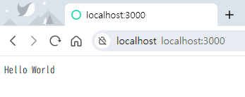

# Chapter 29 Go 언어로 만드는 웹 서버

## HTTP 웹 서버 만들기

Go 언어는 `net/http` 패키지를 사용하여 손쉽기 웹 서버를 만들 수 있다.

몇 줄 안되는 코드로 강력한 웹 서버를 만들 수 있기 때문에 웹 서버를 만들 때 Go를 자주 사용한다.

Go 언어에서 웹 서버를 만들려면 `핸들러 등록` 과 `웹 서버 시작` 의 두단계로 거쳐야 한다.

### 해들러 등록

각 HTTP 요청 URL 경로에 대응할 수 있는 핸들러를 등록한다.

```go
// IndexPathHandler 함수를 정의
func IndexPathHandler(w http.ResponseWriter, R *http.Request) {
    ...
}

// "/" 경로의 HTTP 요청 수신 시에 IndexPathHandler() 함수를 호출하도록 핸들러 등록
http.HandleFunc("/", IndexPathHandler)
```

### 웹서버 시작

핸들러 등록을 마치면 ListenAndServe() 함수를 호출해 웹 서버를 시작한다.

```go
func ListenAndServe(addr string ,handler Handler) error
```

## 완성된 코드

```go
package main

import (
	"fmt"
	"net/http"
)

func main() {
	http.HandleFunc("/", func(w http.ResponseWriter, r *http.Request) {
		fmt.Fprint(w, "Hello World")
	})
	http.ListenAndServe(":3000", nil)
}
```

### 결과

이 프로그램을 실행하면 아무런 출력 결과도 없다.

웹 브라주저를 연 다음 주소창에 `http://localhost:3000` 을 입력하면, 브라우저 화면에 `Hello World` 가 출력된다.


